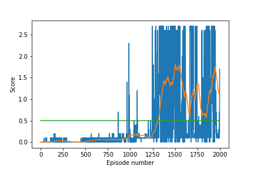
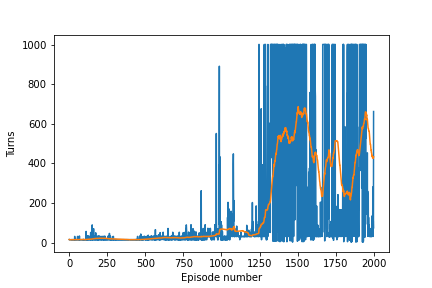

# Introduction

Goal of this project was to train multiple agents to play tennis together. It should run until it reached a terminal state and score as high as possible. The agents always get a possitive score when they hit the ball and they get a negative score if they miss it.

# The Agent

The agent used in the project is a ddpg (Deep Deterministic Policy Gradient) agent with experience replay. The agent is splited in 2 neueral networks an actor and a critic. The actor is used to approximate the best action in the given state. While the critic will approximate the Q-value for the given state and action. Both of them are using soft updates weighted by the factor tau like in Fixed Q-Targets to avoid correlations.
During each step the a concatenated version of the current states of both agents is given to the actor network to determine the 'best' action which is then given to the environment. The resulting SARS' tuple is added to the experience replay and after that a batch of experiences is sampled to train the critic with the TD estimate and using the critic to train the actor.

Both networks consists of an input layer, 2 hidden layers (256 and 128) a dropout layer and an output layer. The Critic network also contains a batch normalization layer. To keep the actor exploring noise (Ornstein-Uhlenbeck process) is added to the choosen action.

The agents were trained twice per episode with a batch of 256 experiences.

# Hyperparameters

Since i tested quite some time with a buggy learning method it is hard to tell which hyper parameter had the most influence on the success. After i fixed my learning method the reduction of the learning rate of 0.01 to 0.001 was an improvement for sure.

| Name | Value | Description |
|---|---:|---|
| TAU | 0.01 | factor for updating the target networks 
| LR_CRITIC | 0.001 | learing rate of the critic
| LR_ACTOR | 0.001 | learning rate of the actor
| GAMMA | 0.99 | discount factor
| BUFFER_SIZE | 50000 | size of the experince replay buffer
| BATCH_SIZE | 256 | amount of memory entries that are taken for each learn step
| sigma | 1.0 |
| mu  | 0.0 |
| theta | 0.15 |
| noise_factor | 0.6 | factor for exploration
| noise_factor_decay | 0.998 | reduction of exploration

# Solving the Environment

The configuration mentioned above solved the environment in episode 1314. It started slow, but steady until in episode 1280 where the score increased drastically and it started to score > 1.0 consistently.

# Future improvements

Overall i would try to experiment further with the hyperparameters.

I also thought of replacing the current experience replay with a proritized experience replay to improve performance.